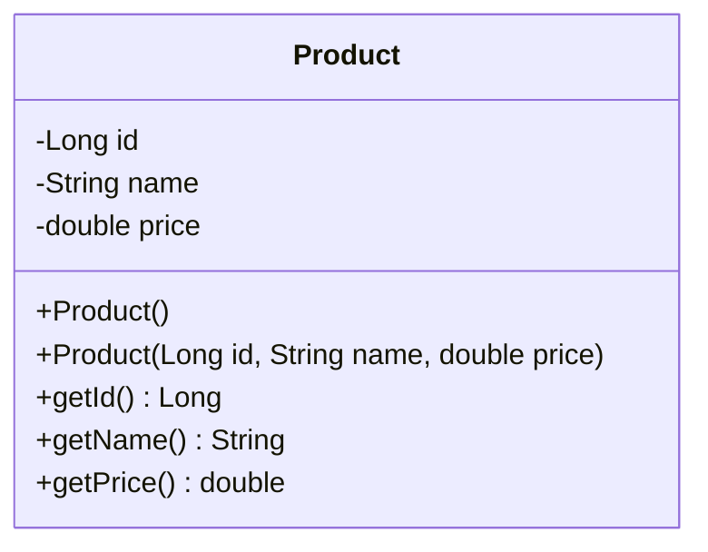

# Product  UML Class Diagram

Tutorial 2, Activity 4.

```mermaid
classDiagram
    class Product {
        -Long id
        -String name
        -double price
        +Product()
        +Product(Long id, String name, double price)
        +getId() Long
        +getName() String
        +getPrice() double
    }
```