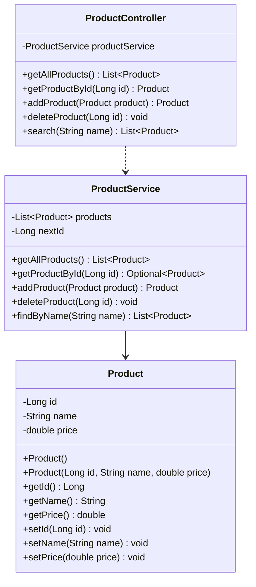

# Product  UML Class Diagram

Tutorial 2, Activity 4. Updated in Tutorial 3, Activity 6 with ProductService and ProductController.

```mermaid
classDiagram
    class Product {
        -Long id
        -String name
        -double price
        +Product()
        +Product(Long id, String name, double price)
        +getId() Long
        +getName() String
        +getPrice() double
        +setId(Long id) void
        +setName(String name) void
        +setPrice(double price) void
    }

    class ProductService {
        -List~Product~ products
        -Long nextId
        +getAllProducts() List~Product~
        +getProductById(Long id) Optional~Product~
        +addProduct(Product product) Product
        +deleteProduct(Long id) void
        +findByName(String name) List~Product~
    }

    class ProductController {
        -ProductService productService
        +getAllProducts() List~Product~
        +getProductById(Long id) Product
        +addProduct(Product product) Product
        +deleteProduct(Long id) void
        +search(String name) List~Product~
    }

    %% ..> is a dependency: DASHED line, open arrow
    ProductController ..> ProductService
    %% --> is an association: SOLID line
    ProductService --> Product
```
